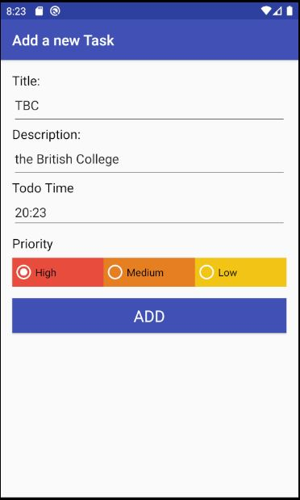
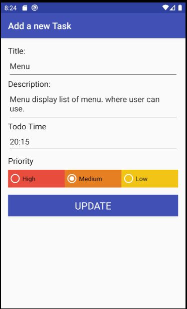
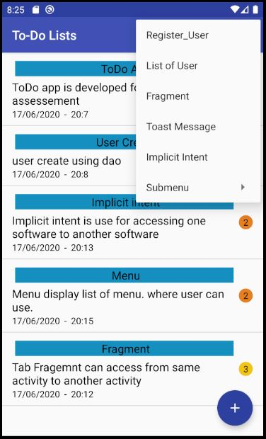
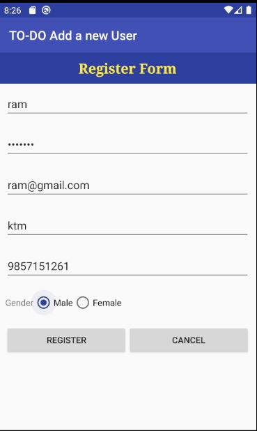
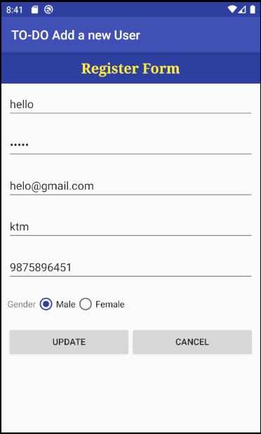
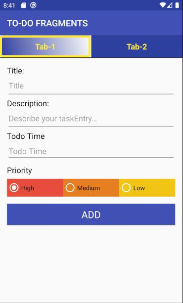

# TODO APP 2020
DMA Final Assessment

This is a simple to-do app

<h3>Introduction</h3>

This is Developing Mobile Application final assesment todo app. this app fullfilled all the requirement as per university provided requirement guide lines.
this app is build by java and following by android architecture.

<h4>App Logo </h4>

<h3>Features of the TODO APP</h3>
<h4>Home Screee</h4>

Home screen dispalys list of task

<h4>ADD TASK</h4>

Add task by clicking floating buttion having plus sign in the home screen 

<h4>UPDATE TASK</h4>

Update task by clicking double to the list data in the home scren list of task.

<h4>Delete Task</h4>

Delete task by swiping the list task from the home screen.

<h4>Add users</h4>

Add users by clicking Register_user menu.

<h4>LIST OF USER</h4>

List of users display all user info.

<h4>DELETE USERS</h4>

Delete usre by swaping the list user specifically from the list of users.

<h4>UPDATE USERES</h4>

Update user by double clicking the user data.

<h4>FRAGEMENT Tab</h4>

Fragement tab dispaly task resgister and user register according to tab wise.

<h4>Toast Message</h4>

Toast Message display a short time viewable message.

<h4>IMPLICIT INTENT</h4>

While cicking implicit intent it redirct to the british college website.
